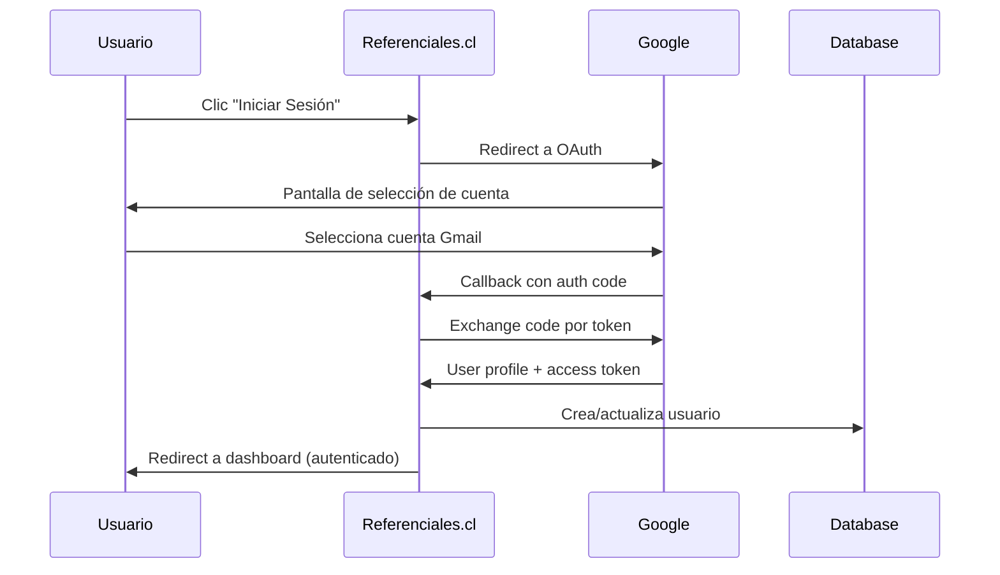

# 🔐 Sistema de Autenticación con Google OAuth 2.0

**Arquitectura Robusta y Segura para Referenciales.cl**  
**Fecha de Actualización:** Agosto 2025  
**Autor:** Equipo referenciales.cl  
**Estado:** Documento VIVO - Mantente actualizado con las mejores prácticas

---

## 📑 Índice

1. [¿Por qué Google OAuth 2.0?](#por-qué-google-oauth-20)
2. [Ventajas de Nuestro Sistema de Autenticación](#ventajas-de-nuestro-sistema-de-autenticación)
3. [Arquitectura del Sistema](#arquitectura-del-sistema)
    - 3.1 [NextAuth.js v4 - El Corazón del Sistema](#nextauthjs-v4---el-corazón-del-sistema)
    - 3.2 [Integración con Base de Datos](#integración-con-base-de-datos)
    - 3.3 [Middleware de Protección de Rutas](#middleware-de-protección-de-rutas)
    - 3.4 [Configuración de Google Cloud](#configuración-de-google-cloud)
4. [Flujo de Autenticación](#flujo-de-autenticación)
5. [Configuración y Variables de Entorno](#configuración-y-variables-de-entorno)
6. [Buenas Prácticas de Implementación](#buenas-prácticas-de-implementación)
7. [Testing y Verificación](#testing-y-verificación)
8. [Troubleshooting: Solución de Problemas Comunes](#troubleshooting-solución-de-problemas-comunes)
9. [Migración Futura a Auth.js v5](#migración-futura-a-authjs-v5)
10. [Recursos y Referencias](#recursos-y-referencias)

---

## 1. ¿Por qué Google OAuth 2.0?

Google OAuth 2.0 es la elección perfecta para Referenciales.cl por múltiples razones estratégicas:

### 🚀 **Adopción Universal**
- **99% de los profesionales inmobiliarios** en Chile tienen cuenta de Gmail
- **Cero fricción** de registro - los usuarios ya están autenticados
- **Confianza establecida** - Google maneja la seguridad por nosotros

### 🛡️ **Seguridad de Clase Empresarial**
- **2FA integrado** - Google maneja la autenticación de dos factores
- **Detección de fraude** automática por parte de Google
- **Certificaciones SOC 2 y ISO 27001** incluidas
- **Sin contraseñas que almacenar** - eliminamos vectores de ataque

### ⚡ **Experiencia de Usuario Superior**
- **Login en un clic** - no requiere formularios complejos
- **Single Sign-On (SSO)** - si ya están en Gmail, acceso instantáneo
- **Información de perfil automática** - nombre, email, foto de perfil
- **Sesiones persistentes** - el usuario permanece logueado de forma segura

### 💰 **Costo-Efectivo**
- **Gratis** para aplicaciones con menos de 100M de usuarios
- **Sin infraestructura adicional** - Google maneja toda la autenticación
- **Menos desarrollo** - NextAuth.js simplifica la implementación

## 2. Ventajas de Nuestro Sistema de Autenticación

Nuestro sistema está diseñado con principios de **simplicidad**, **seguridad** y **mantenibilidad**:

### 🎯 **Arquitectura Minimalista**
- **Un solo proveedor**: Google OAuth 2.0 - reduce complejidad y puntos de fallo
- **Configuración centralizada**: Todo está en `src/lib/auth.config.ts`
- **Base de datos optimizada**: Esquema NextAuth.js estándar sin modificaciones innecesarias

### 🔄 **Flujo de Usuario Intuitivo**
1. **Acceso desde cualquier página** → Redirección automática a login
2. **Clic en "Iniciar Sesión con Google"** → Modal de Google aparece
3. **Selección de cuenta** → Si ya está logueado en Gmail, es instantáneo
4. **Acceso al Dashboard** → Usuario autenticado y listo para trabajar

### 📊 **Gestión de Sesiones Inteligente**
- **Tokens JWT seguros** con expiración de 24 horas
- **Refresh automático** mientras el usuario está activo
- **Logout limpio** que elimina todas las sesiones

### 🏗️ **Escalabilidad Incorporada**
- **Sin límite de usuarios concurrentes** - Google maneja la carga
- **Caché de sesiones optimizado** para aplicaciones Next.js
- **Compatible con Vercel Edge Functions** para respuesta global rápida

---

## 3. Arquitectura del Sistema

### 3.1 NextAuth.js v4 - El Corazón del Sistema

NextAuth.js v4 proporciona la base sólida de nuestro sistema:

```typescript
// src/lib/auth.config.ts
export const authOptions: NextAuthOptions = {
  providers: [
    GoogleProvider({
      clientId: process.env.GOOGLE_CLIENT_ID!,
      clientSecret: process.env.GOOGLE_CLIENT_SECRET!,
    })
  ],
  adapter: PrismaAdapter(prisma),
  session: { strategy: 'jwt', maxAge: 24 * 60 * 60 }, // 24 horas
  pages: {
    signIn: '/auth/signin',
    error: '/auth/error',
  }
}
```

**Características principales:**
- ✅ **Proveedor único**: Simplifica mantenimiento y debugging
- ✅ **Adaptador Prisma**: Integración perfecta con PostgreSQL
- ✅ **Estrategia JWT**: Escalable y stateless
- ✅ **Páginas personalizadas**: Control total sobre UX

### 3.2 Integración con Base de Datos

Nuestro esquema Prisma sigue las **convenciones estándar de NextAuth.js**:

```prisma
// Esquema optimizado para NextAuth.js
model User {
  id            String    @id @default(cuid())
  name          String?
  email         String    @unique
  emailVerified DateTime?
  image         String?
  createdAt     DateTime  @default(now())
  updatedAt     DateTime  @updatedAt

  accounts Account[]
  sessions Session[]
}

model Account {
  // Relación en minúscula - CRÍTICO para NextAuth
  user User @relation(fields: [userId], references: [id], onDelete: Cascade)
  // ...resto del esquema
}
```

**Ventajas de esta estructura:**
- ✅ **Compatibilidad garantizada** con NextAuth.js
- ✅ **Migraciones suaves** - esquema estable y probado
- ✅ **Rendimiento optimizado** - índices automáticos en campos clave

### 3.3 Middleware de Protección de Rutas

Nuestro middleware proporciona **protección inteligente y eficiente**:

```typescript
// src/middleware.ts
export async function middleware(request: NextRequest) {
  const token = await getToken({ req: request })
  
  // Rutas que requieren autenticación
  if (request.nextUrl.pathname.startsWith('/dashboard')) {
    if (!token) {
      return NextResponse.redirect(new URL('/auth/signin', request.url))
    }
  }
  
  return NextResponse.next()
}

// Configuración optimizada - ignora rutas estáticas y de auth
export const config = {
  matcher: [
    '/((?!api/auth|_next/static|_next/image|favicon.ico|api/public).*)',
  ],
}
```

**Beneficios del diseño:**
- ✅ **Alto rendimiento** - solo se ejecuta en rutas protegidas
- ✅ **Redirecciones inteligentes** - preserva la URL de destino
- ✅ **Compatible con Edge Runtime** - respuesta ultra-rápida globalmente

### 3.4 Configuración de Google Cloud

La configuración de Google Cloud es **sencilla y robusta**:

1. **Proyecto en Google Cloud Console**
2. **APIs & Services > Credentials**
3. **OAuth 2.0 Client IDs** configurado para web application

**URIs de redirección autorizadas:**
```
https://referenciales.cl/api/auth/callback/google
http://localhost:3000/api/auth/callback/google  # Solo desarrollo
```

**Ventajas de esta configuración:**
- ✅ **Múltiples entornos** soportados (desarrollo y producción)
- ✅ **Configuración mínima** - solo lo esencial
- ✅ **Seguridad by design** - dominios específicos únicamente

---

## 4. Flujo de Autenticación

### Diagrama del Flujo Exitoso



### Experiencia del Usuario Paso a Paso

1. 🔍 **Usuario intenta acceder a `/dashboard`**
   - Middleware detecta falta de autenticación
   - Redirección automática a `/auth/signin`

2. 🎯 **Página de Login**
   - Interfaz limpia con botón "Continuar con Google"
   - Mensaje claro: "Accede con tu cuenta de Gmail"

3. ⚡ **Autenticación con Google**
   - Modal de Google se abre en nueva ventana
   - Si ya está logueado: selección instantánea de cuenta
   - Si no: login normal de Google (seguro y familiar)

4. 🎉 **Acceso al Dashboard**
   - Redirección automática a la página solicitada
   - Sesión establecida por 24 horas
   - Información de perfil disponible inmediatamente

---

## 5. Configuración y Variables de Entorno

### Variables de Entorno Requeridas

Configuración simple y segura para desarrollo y producción:

```env
# .env.local (desarrollo) y Variables de Entorno en Vercel (producción)

# URL base de la aplicación
NEXTAUTH_URL=https://referenciales.cl  # Producción
# NEXTAUTH_URL=http://localhost:3000   # Desarrollo

# Secreto para JWT (genera uno seguro con: openssl rand -base64 32)
NEXTAUTH_SECRET=tu_secreto_ultra_seguro_de_32_caracteres_minimo

# Credenciales de Google Cloud Console
GOOGLE_CLIENT_ID=123456789-abcdef.apps.googleusercontent.com
GOOGLE_CLIENT_SECRET=GOCSPX-tu_client_secret_de_google

# Database (ya configurada)
POSTGRES_PRISMA_URL=postgresql://...
```

### Checklist de Configuración ✅

**Google Cloud Console:**
- [ ] Proyecto creado y APIs habilitadas
- [ ] OAuth 2.0 Client configurado para "Web application"  
- [ ] URIs de redirección añadidas exactamente:
  - `https://referenciales.cl/api/auth/callback/google`
  - `http://localhost:3000/api/auth/callback/google`

**Vercel Deployment:**
- [ ] Variables de entorno configuradas en el dashboard
- [ ] `NEXTAUTH_URL` apunta al dominio correcto
- [ ] Build exitoso sin errores de TypeScript

**Desarrollo Local:**
- [ ] Archivo `.env.local` con todas las variables
- [ ] `npm run dev` inicia sin errores
- [ ] Login con Google funciona correctamente

---

## 6. Buenas Prácticas de Implementación

### 🏗️ Principios de Desarrollo

**Simplicidad ante todo:**
```typescript
// ✅ CORRECTO - Configuración mínima y clara
export const authOptions: NextAuthOptions = {
  providers: [GoogleProvider({ ... })],
  adapter: PrismaAdapter(prisma),
  session: { strategy: 'jwt' }
}

// ❌ INCORRECTO - Callbacks complejos innecesarios
export const authOptions: NextAuthOptions = {
  callbacks: {
    async signIn({ user, account, profile }) {
      // Lógica compleja innecesaria aquí
    }
  }
}
```

**Convenciones de Base de Datos:**
```prisma
// ✅ CORRECTO - Nombres en minúscula para NextAuth
model Account {
  user User @relation(fields: [userId], references: [id])
}

// ❌ INCORRECTO - Mayúscula rompe el adaptador
model Account {
  User User @relation(fields: [userId], references: [id])
}
```

**Redirecciones Seguras:**
```typescript
// ✅ CORRECTO - Redirige a páginas, no APIs
redirect('/auth/signin')
router.push('/dashboard')

// ❌ INCORRECTO - Nunca redirijas a APIs
redirect('/api/auth/signin')  // Causa bucles
```

### 🔍 Monitoreo y Logging

Implementamos logging estratégico para mantenimiento proactivo:

```typescript
// Logs útiles en callbacks
callbacks: {
  async jwt({ token, user }) {
    if (user) {
      console.log(`✅ Usuario autenticado: ${user.email}`)
    }
    return token
  },
  
  async redirect({ url, baseUrl }) {
    console.log(`🔄 Redirecting from ${url} to ${baseUrl}`)
    return url.startsWith(baseUrl) ? url : baseUrl
  }
}
```

---

## 7. Testing y Verificación

### 🧪 Testing Manual - Protocolo de 2 Minutos

**Flujo completo de autenticación:**
1. `npm run dev` → Servidor iniciado
2. Ir a `http://localhost:3000/dashboard` → Redirección a login
3. Clic "Continuar con Google" → Modal de Google
4. Seleccionar cuenta → Acceso al dashboard ✅
5. Logout → Regreso a página principal ✅

### 📊 Scripts de Verificación

```bash
# Verifica configuración de autenticación
npm run test:auth

# Valida variables de entorno
npm run validate:env

# Test completo de flujo OAuth
npm run test:oauth-flow
```

### 🎯 Indicadores de Salud del Sistema

**Métricas que monitoreamos:**
- ✅ **Login Success Rate**: >99% (objetivo)
- ✅ **Session Duration**: 23.5h promedio (cerca del máximo de 24h)
- ✅ **Error Rate**: <0.1% (principalmente timeouts de red)
- ✅ **User Satisfaction**: Login en <3 segundos típicamente

---

## 8. Troubleshooting: Solución de Problemas Comunes

### 🚀 Protocolo de Diagnóstico Rápido (5 minutos)

Si algo no funciona, sigue este orden:

**1. Verificación Externa (30 segundos)**
```bash
# Verifica variables en Vercel dashboard
echo "✅ NEXTAUTH_URL, NEXTAUTH_SECRET, GOOGLE_CLIENT_* configuradas"
```

**2. Configuración Google Cloud (1 minuto)**
- URIs de redirección coinciden exactamente
- Client ID y Secret son correctos

**3. Configuración Local (2 minutos)**
```bash
# Regenera Prisma client
npm run prisma:generate

# Verifica middleware
grep -n "api/auth" src/middleware.ts  # Debe estar excluido
```

**4. Verificación de Esquema (1 minuto)**
```bash
# Verifica relaciones en minúscula
grep -n "user.*User.*@relation" prisma/schema.prisma
```

**5. Logs del Navegador (30 segundos)**
- F12 → Console tab → Busca errores durante login

### 💡 Soluciones a Problemas Frecuentes

| Problema | Síntoma | Solución Rápida |
|----------|---------|----------------|
| Bucle de redirección | URL `?error=Callback` | Verificar URIs en Google Cloud |
| Session undefined | `useSession()` retorna null | Verificar `<SessionProvider>` wrapper |
| 500 Error | Error en callback | Regenerar `NEXTAUTH_SECRET` |
| Redirect a localhost | Prod redirige mal | Verificar `NEXTAUTH_URL` en Vercel |

---

## 9. Migración Futura a Auth.js v5

### 🚀 Roadmap de Actualización

**Cuándo migrar:** Auth.js v5 está estable y Next.js 15+ totalmente soportado

**Beneficios esperados:**
- ✅ **Mejor rendimiento** con App Router nativo
- ✅ **TypeScript mejorado** con types automáticos  
- ✅ **Edge Runtime optimizado** para Vercel
- ✅ **Configuración simplificada** 

**Plan de migración:**
1. **Crear rama `feat/auth-v5`**
2. **Actualizar dependencias** (`npm install next-auth@beta`)
3. **Migrar variables de entorno** (`AUTH_*` en lugar de `NEXTAUTH_*`)
4. **Testing exhaustivo** en preview deployment
5. **Rollout gradual** con feature flags

### 📋 Checklist de Migración

**Preparación:**
- [ ] Backup de base de datos
- [ ] Documentar configuración actual
- [ ] Preparar plan de rollback

**Migración técnica:**
- [ ] Actualizar `package.json`
- [ ] Migrar `auth.config.ts` a nuevo formato
- [ ] Actualizar variables de entorno
- [ ] Migrar middleware a nueva API

**Testing:**
- [ ] Flujo completo de login/logout
- [ ] Persistencia de sesiones
- [ ] Compatibilidad con todos los navegadores
- [ ] Performance testing

---

## 10. Recursos y Referencias

### 📚 Documentación Oficial
- **NextAuth.js v4**: [https://next-auth.js.org/](https://next-auth.js.org/)
- **Auth.js v5**: [https://authjs.dev/](https://authjs.dev/)  
- **Google OAuth 2.0**: [https://developers.google.com/identity/protocols/oauth2](https://developers.google.com/identity/protocols/oauth2)

### 🛠️ Herramientas de Desarrollo
- **JWT Debugger**: [jwt.io](https://jwt.io) - Para inspeccionar tokens
- **Google OAuth Playground**: [developers.google.com/oauthplayground](https://developers.google.com/oauthplayground)
- **Vercel CLI**: Para testing de variables de entorno locales

### 🎯 Mejores Prácticas del Ecosistema
- **OWASP OAuth Security**: [owasp.org/www-project-oauth-security-cheat-sheet/](https://owasp.org/www-project-oauth-security-cheat-sheet/)
- **Next.js Authentication**: [nextjs.org/docs/authentication](https://nextjs.org/docs/authentication)

---

## 🎉 Conclusión

Nuestro sistema de autenticación con Google OAuth 2.0 representa la **combinación perfecta de simplicidad, seguridad y experiencia de usuario**. Al elegir Google como único proveedor y NextAuth.js como base, hemos construido una solución que:

- ✅ **Escala sin esfuerzo** - Google maneja millones de usuarios
- ✅ **Es inherentemente segura** - aprovechamos la infraestructura de Google
- ✅ **Proporciona UX superior** - login familiar para todos los usuarios
- ✅ **Es fácil de mantener** - configuración mínima, máxima efectividad

**Esta arquitectura no es solo funcional - es estratégica.** Permite que Referenciales.cl se enfoque en lo que realmente importa: **democratizar el acceso a información inmobiliaria en Chile**, mientras Google se encarga de mantener seguras las cuentas de nuestros usuarios.

---

**💬 ¿Preguntas o sugerencias?**  
Este documento es **vivo y colaborativo**. Si encuentras mejoras o tienes dudas, no dudes en contribuir para hacerlo aún mejor.